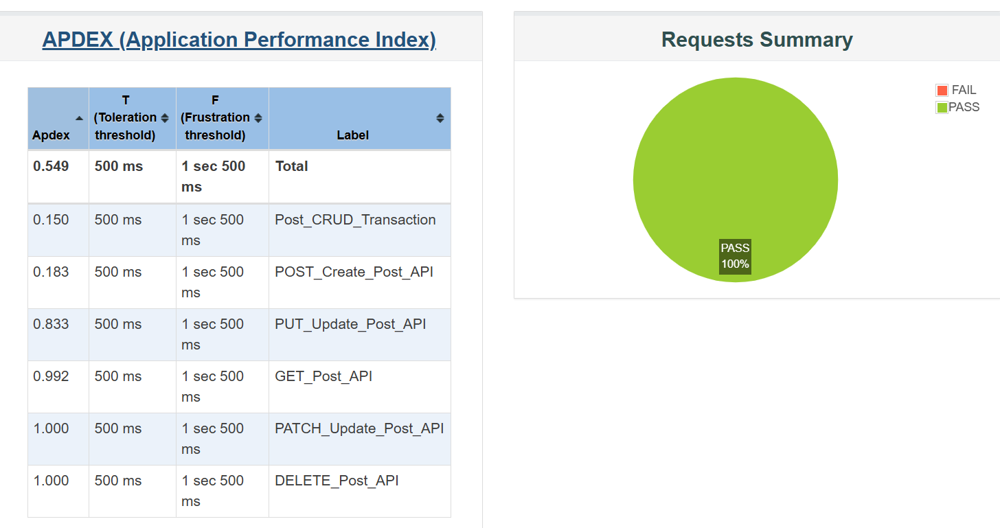
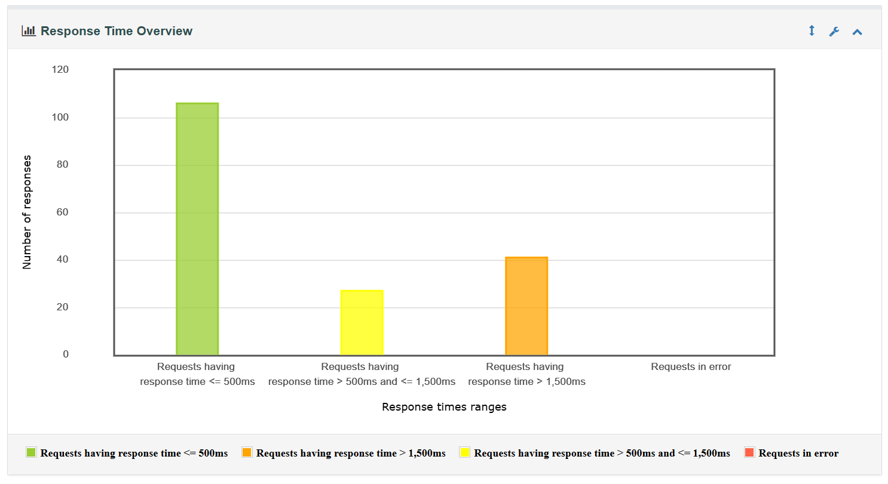
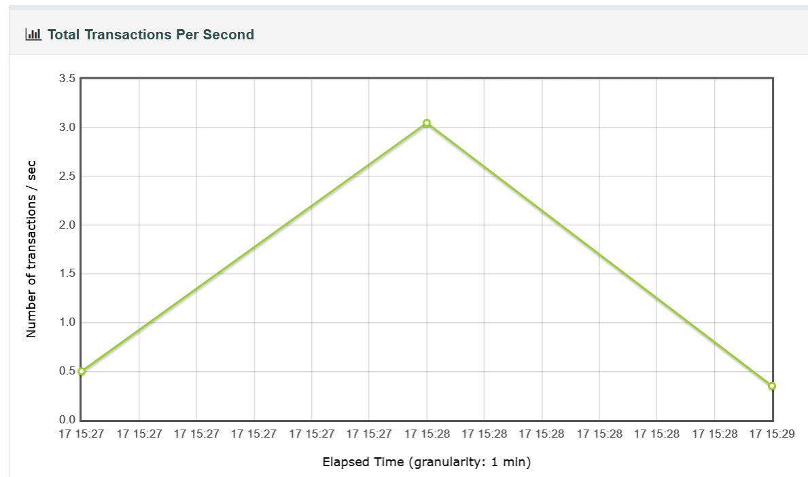

# 🚀 API Performance Testing using Apache JMeter

## 📌 Project Overview

This project demonstrates **API performance testing** using Apache JMeter by simulating multiple users performing **CRUD (Create, Read, Update, Delete)** operations on the JSONPlaceholder API.

The test design includes **data-driven testing, dynamic data handling (correlation), realistic user behavior simulation**, and **HTML dashboard reporting**.

---

## 🧰 Tech Stack

* Apache JMeter
* JSONPlaceholder (Fake REST API)
* CSV (Test Data)
* HTML Dashboard Report

---

## ⚙️ Features Implemented

### 🔹 API Coverage

* POST → Create resource
* GET → Retrieve resource
* PUT → Update resource
* PATCH → Partial update
* DELETE → Remove resource

---

### 🔹 Performance Testing Concepts

* Thread Group (Load Simulation)
* Ramp-up Period (User distribution)
* Loop Count (Iterations)

---

### 🔹 Data Handling

* CSV Data Set Config for parameterization
* JSON Extractor for dynamic data correlation

---

### 🔹 Controllers Used

* Transaction Controller → Measure complete API flow
* Loop Controller → Repeat requests
* Once Only Controller → Execute once per user
* If Controller → Conditional execution
* Throughput Controller → Control request frequency
* While Controller → Condition-based looping

---

### 🔹 Validation

* Response Assertion (Status Code Validation)
* Duration Assertion (Response Time Check)

---

### 🔹 Realistic Simulation

* Think Time (Timers) to mimic user behavior
* Conditional API execution based on response

---

### 🔹 Reporting

* Non-GUI test execution
* HTML Dashboard Report generation
* Performance metrics analysis:

  * Response Time
  * Throughput
  * Error Percentage
  * Percentiles

---

## 🧪 Test Scenario

| Parameter      | Value  |
| -------------- | ------ |
| Users          | 20     |
| Ramp-up Time   | 10 sec |
| Loop Count     | 3      |
| Total Requests | ~300   |

---

## 📊 Results

* Successfully simulated concurrent users performing CRUD operations
* Generated JMeter HTML Dashboard report
* Analyzed system performance using response time, throughput, and error metrics

---

## 📸 Screenshots

### Dashboard


### Response Time Graph


### Throughput Graph


## 📂 Project Structure

---

```
JMeter-API-Performance-Test/
│
├── test_plan/
│     └── jsonplaceholder_api_performance_test.jmx
│
├── test_data/
│     └── users.csv
│
├── results/
│     └── results.jtl
│
├── report/
│     └── index.html
│
└── README.md
```

---

## ▶️ How to Run the Test

### 1️⃣ Run in Non-GUI Mode

```
jmeter -n -t test_plan.jmx -l results.jtl
```

### 2️⃣ Generate HTML Report

```
jmeter -g results.jtl -o report
```

---

## 📈 Key Learnings

* Designing scalable API performance test scenarios
* Handling dynamic data using correlation
* Simulating real user behavior using controllers and timers
* Executing JMeter tests in non-GUI mode
* Analyzing performance metrics using HTML reports

---

## 🎯 Conclusion

This project demonstrates a **complete API performance testing workflow** using Apache JMeter, covering scripting, execution, and analysis.

---

## 👩‍💻 Author

**Pragati Nangare**

---
